# Decision: Auto-Trading System Boundaries and Data Flow

## Date
2026-04-25

## Status
Foundational. Locked-in for REQ-018; downstream REQ-019 ~ REQ-029 must respect
these boundaries. Any deviation needs a follow-up decision doc.

## Context
The repo is moving from "collect facts and run market analysis" into a full
auto-trading system: real-time watchlist monitoring, signal generation, risk
control, approval gates, and order execution against live brokers. Without
defining the layer boundaries first, the natural drift is for Java delivery,
Python analysis, and order middleware to couple — LLM output sneaking into
broker calls, source facts written straight into analysis tables, or Java
re-acquiring direct trading state.

REQ-018 is the gate: the four-layer split, the table ownership matrix, the
operating modes, and the safety gates have to be written down once, and every
later REQ refers back here.

This document is intentionally narrow: it does **not** specify schemas in
column-level detail (those belong in REQ-019 ~ REQ-028) and does **not**
choose a specific broker adapter (REQ-028).

## Decision

### 1. Four-layer split

| Layer | Repo | Owns | Does NOT own |
|---|---|---|---|
| **Python — data + analysis** | this repo (`data-collecting`) | source ingestion, event normalisation, market analysis pipeline, watchlist, signal/decision/order middleware | LINE delivery, broker creds for production |
| **Java — delivery** | `line-relay-service` | LINE webhook, group/user mgmt, subscription preferences, push history, command handling | analysis logic, decision logic, broker calls |
| **Decision** | logical layer inside Python | strategy KB, risk checks, approval gates, mode switching | LLM-driven free-form trading; data ingestion |
| **Order execution** | logical layer inside Python | broker adapter, order intent → order → fill lifecycle, position state, kill switch | strategy decisions, LLM calls |

Decision and Order are logical layers, not separate repos. They live in the
Python repo but are isolated by package boundaries (`event_relay` /
`decision_engine` / `order_execution`) and by table ownership.

### 2. Core tables and write ownership

Only the listed owner is allowed to **write** to a table. Every other layer
reads. Cross-layer writes go through service interfaces, never raw SQL.

| Table | Owner | Purpose | Introduced by |
|---|---|---|---|
| `t_relay_events` | Python data_ingestion | normalised source facts (news, X, market_context, announcements) | existing |
| `t_market_quote_snapshots` | Python data_ingestion | high-frequency price snapshots (kept out of `t_relay_events` to avoid bloat) | REQ-019 |
| `t_relay_event_annotations` | Python data_ingestion | enrichment / impact tags layered on relay events | REQ-020 (optional, may live in `raw_json`) |
| `t_x_posts` | Python data_ingestion | raw X posts; relay event side written into `t_relay_events` | existing |
| `t_market_analyses` | Python analysis_engine | LLM analysis output incl. structured `trade_ideas`, `market_bias`, `scenario_matrix` | existing (REQ-017 / REQ-022) |
| `t_analysis_delivery_logs` | **Java delivery** | per-target push records (success / failure / retry) | REQ-023 |
| `t_trade_watchlist` | Python market_watch | active trade ideas being monitored intra-day | REQ-024 |
| `t_watchlist_price_snapshots` | Python market_watch | intra-day price refreshes for watchlist symbols | REQ-024 |
| `t_watchlist_trigger_events` | Python market_watch | "entry zone hit", "invalidation breached" events | REQ-024 |
| `t_strategy_kb` | Python decision_engine | strategy templates (breakout, pullback, event-driven, ...) | REQ-025 |
| `t_strategy_symbol_overrides` | Python decision_engine | per-symbol allow/deny, position cap, earnings blackout | REQ-025 |
| `t_trade_signals` | Python decision_engine | candidate signals derived from analysis + watchlist triggers | REQ-026 |
| `t_trade_decisions` | Python decision_engine | signal → strategy match → risk check → approval status | REQ-026 |
| `t_risk_limits` | Python decision_engine | global / strategy / symbol risk caps and switches | REQ-026 |
| `t_order_intents` | Python order_execution | approved decisions converted to broker-agnostic intent | REQ-027 |
| `t_orders` | Python order_execution | per-broker order rows | REQ-027 |
| `t_order_events` | Python order_execution | order lifecycle audit (submit / replace / cancel / reject) | REQ-027 |
| `t_fills` | Python order_execution | partial / full fills | REQ-027 |
| `t_positions` | Python order_execution | symbol-level position with cost / pnl | REQ-027 |

Hard rules that follow from the table ownership:

- **Source data never lands in `t_market_analyses`.** Source facts go to
  `t_relay_events` (or `t_market_quote_snapshots` for HF data) first; analysis
  reads from there and writes to `t_market_analyses`.
- **LLM output never lands in `t_order_intents` directly.** Analysis writes
  `trade_ideas` into `t_market_analyses.structured_json`. Watchlist consumes
  that. Decision engine consumes watchlist triggers and produces signals.
  Order intent only comes from approved decisions.
- **Java does not write to anything Python owns** and vice versa. Analysis
  delivery logs are Java-owned because they describe Java's own work.

### 3. Operating modes

Three modes are defined globally and per-strategy. The default is always the
most conservative.

| Mode | Decision → order intent | Per-symbol approval | Default for |
|---|---|---|---|
| `manual` | Decision is created but **never** auto-promoted. Human must approve every order intent. | always | default for everything until paper trading is stable |
| `semi_auto` | Decisions below a configured risk threshold auto-promote; rest go to approval queue. | required when `t_strategy_symbol_overrides.requires_approval = true` or risk flag is set | enabled only after REQ-026 risk gates and REQ-027 paper trading both pass |
| `auto` | All approved decisions auto-promote, subject to risk caps and kill switch. | required only on flagged symbols | not enabled until REQ-028 broker adapter, reconciliation, and kill switch are all live |

Mode is stored in config with two switches:

- `global_mode` ∈ `{manual, semi_auto, auto}` — the highest mode that can apply.
- `strategy.<key>.mode_override` — a strategy may downgrade itself but never
  upgrade past `global_mode`.

Both are surfaced through the `t_risk_limits` table and a single configuration
file so an operator can flip `global_mode = manual` without code change.

### 4. Safety gates (must hold even if every other layer fails)

#### a. Kill switch
- **Global kill switch:** a single boolean (`risk_limits.scope=global`,
  `enabled=false`) blocks all new order intent submission. The Order layer
  checks this on every submit; existing open orders are not auto-cancelled.
- **Per-symbol kill:** an entry in `t_strategy_symbol_overrides` with
  `allowed_long=false AND allowed_short=false` blocks new signals against that
  symbol.
- **Broker-connectivity kill:** broker adapter health check failure
  auto-flips global kill switch to `false` and surfaces an incident.

The kill switch is a write to the same DB the decision engine reads, so it
takes effect within the next decision cycle without a deploy. There is no
cache that can hide a kill-switch flip.

#### b. Approval gates (places the LLM cannot bypass)
1. **Analysis → trade_idea:** LLM may write `trade_ideas` only into
   `t_market_analyses.structured_json`. The schema does **not** include any
   "submit" or "execute" field. There is no path from analysis to
   `t_order_intents` that does not go through the decision engine.
2. **Watchlist → signal:** signals are generated by deterministic Python code
   reading watchlist triggers, not by an LLM call. (LLM may write rationale,
   never the trigger itself.)
3. **Signal → decision:** must pass strategy KB match + risk check
   (REQ-026). Decisions that fail any check are stored with
   `decision_status='rejected'` and never become an order intent.
4. **Decision → order intent:** mode-dependent. In `manual` and approval-
   required cases, a human must mark `approval_status='approved'` in
   `t_trade_decisions` before the order layer will pick it up.
5. **Order intent → broker:** the broker adapter holds the broker
   credentials. The credentials are not available to any LLM call site, by
   process and config separation. There is no "ask the model to submit" code
   path; submission is a deterministic Python function reading
   `t_order_intents`.

#### c. Per-decision traceability
Every row in `t_market_analyses`, `t_trade_signals`, `t_trade_decisions`,
`t_order_intents`, `t_orders` carries `evidence_refs` / `signal_id` /
`decision_id` and a `prompt_version` or `rule_version` field. Any production
order can be walked back to: source event ids → analysis row → signal →
decision → order. This is required by acceptance for REQ-018 and is the
audit hook for REQ-029 evaluation.

### 5. End-to-end flow

```mermaid
flowchart LR
    SRC[Source feeds<br/>news, X, market_context,<br/>BLS, TWSE/MOPS, quotes] --> EVT[(t_relay_events<br/>+ t_market_quote_snapshots)]
    EVT --> ANA[Analysis pipeline<br/>multi-stage v2]
    ANA --> ANR[(t_market_analyses<br/>structured.trade_ideas)]

    ANR --> WATCH[Watchlist generator]
    WATCH --> WL[(t_trade_watchlist<br/>+ price snapshots<br/>+ trigger events)]

    WL --> SIG[Signal generator<br/>deterministic]
    SIG --> SIGT[(t_trade_signals)]

    SIGT --> RISK[Strategy KB match<br/>+ Risk check<br/>+ Approval gate]
    RISK --> DEC[(t_trade_decisions)]

    DEC -->|approved + mode allows| OI[(t_order_intents)]
    OI --> ORD[Broker adapter]
    ORD --> BR[Broker API]
    ORD --> ORDT[(t_orders / t_fills / t_positions)]

    ANR -. read-only .-> JAVA[Java line-relay-service]
    JAVA --> DEL[(t_analysis_delivery_logs)]

    KILL[[Kill switch<br/>global / per-symbol / broker]]
    KILL -.blocks.-> RISK
    KILL -.blocks.-> OI
    KILL -.blocks.-> ORD
```



ASCII fallback (for readers without Mermaid):

```
sources -> t_relay_events / quote snapshots
                |
                v
         analysis pipeline
                |
                v
        t_market_analyses  ----read-only---->  Java delivery (LINE)
                |                                   |
                v                                   v
         watchlist gen                    t_analysis_delivery_logs
                |
                v
       t_trade_watchlist + triggers
                |
                v
        signal generator (deterministic)
                |
                v
         t_trade_signals
                |
                v
   strategy KB match + risk check + approval
                |
                v
        t_trade_decisions
                |
                v  (mode-gated, kill-switch checked)
        t_order_intents
                |
                v
         broker adapter
                |
                v
   t_orders / t_fills / t_positions  ->  broker API
```

## Mandatory invariants (cited in every later REQ)

1. **Facts before analysis.** Source data must land in `t_relay_events` (or
   `t_market_quote_snapshots`) before any analysis row references it. No
   collector writes to `t_market_analyses`.
2. **No LLM-to-broker path.** No code path takes LLM output and submits an
   order in the same process. The path must traverse signal → decision →
   approval → order intent.
3. **Default mode is `manual`** until paper trading and reconciliation are
   live (REQ-027 / REQ-028). Flipping past `manual` requires explicit config
   change and recorded incident-readiness.
4. **Kill switch is honoured at submission time**, not at decision time.
   Decisions can still be created when global kill is engaged; only the
   submission step is blocked. This preserves audit trail.
5. **Every artefact is traceable.** Analysis row → evidence_ref ids; decision
   row → strategy_key + signal_id + risk flags; order row → decision_id +
   prompt_version / rule_version.
6. **Java owns delivery, full stop.** Python repos must not re-introduce a
   linebot / push / webhook contact path. Pre-existing decision
   `2026-04-21-remove-python-line-touch` remains in force.

## Non-goals (deliberately deferred)

- Column-level schemas (handled per-table by REQ-019 ~ REQ-028).
- Choice of broker, paper-broker implementation, sandbox connection details
  (REQ-027 / REQ-028).
- Real-time streaming infra. Polling cadences and event-loop choices are
  per-REQ. This doc only mandates the table contracts and gate placement.
- LLM model and prompt-cache strategy (REQ-016).
- RAG over historical analysis (REQ-014).

## Alternatives considered

- **One monolithic auto-trader script.** Rejected: couples LLM output to
  broker submission, makes audit and kill switch impossible.
- **Decision and order layers as separate Java services.** Rejected for now:
  the analysis layer is in Python and shares the same data store; splitting
  decision/order into Java would force duplicated DB clients and a network
  hop on the latency-sensitive path. Logical-package separation inside Python
  gives most of the isolation without the operational cost. Revisit if
  decision throughput exceeds a single-process budget.
- **LLM produces order intents directly.** Rejected: violates audit, violates
  risk control, violates the "facts before analysis" symmetry. Has been the
  most common failure mode in third-party agent systems.

## Consequences

- All REQ-019 through REQ-029 must reference this doc when introducing a new
  table or layer. Schemas that would violate write-ownership are blocked at
  review.
- The default operating mode is `manual` until REQ-026 risk gates and
  REQ-027 paper trading are both green. No production order can be submitted
  before then.
- Java repo (`line-relay-service`) is the sole writer of
  `t_analysis_delivery_logs`. Python repo never touches it.
- A future kill-switch admin surface is required (CLI is enough for v1) —
  added implicitly to REQ-026.
- Traceability fields (`evidence_refs`, `signal_id`, `decision_id`,
  `rule_version`) are required across all auto-trading tables; REQ-029
  evaluation depends on them being populated from day one.
